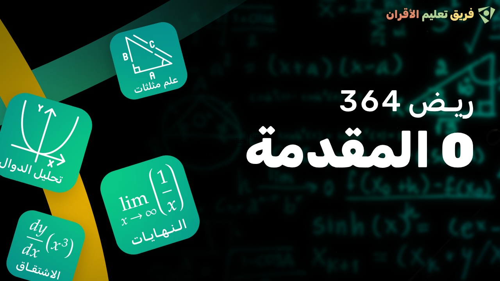

# PeerLearning Academy

Welcome to the PeerLearning Academy repository! PeerLearning Academy is an educational platform dedicated to fostering peer-to-peer learning through engaging lectures and challenging assignments. Whether you're a student looking to expand your knowledge or an educator seeking inspiration, you've come to the right place.

## Lecture Videos

In this section, you'll find links to the lecture videos hosted on YouTube, along with their thumbnails:
### lecture 0: introduction

   - Description: In this lecture I introduce myself and I explain the purpose of this course.

## Assignments

The assignments for each course are written in LaTeX. You can find the LaTeX source code for assignments in the following directories:

### lectrue 0
- [Table of Content](./math364/lecture0/table-of-content/table-of-content-final.pdf)

## Connect with Us

- Follow PeerLearning Academy on Instagram: 
- Follow me on Instagram: 

Please feel free to explore the content in this repository, watch the lecture videos, and work on the assignments to enhance your learning experience. If you have any questions or feedback, don't hesitate to [contact us](mailto:your@email.com).

Happy learning!